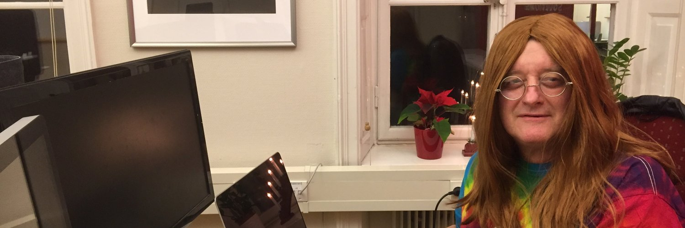
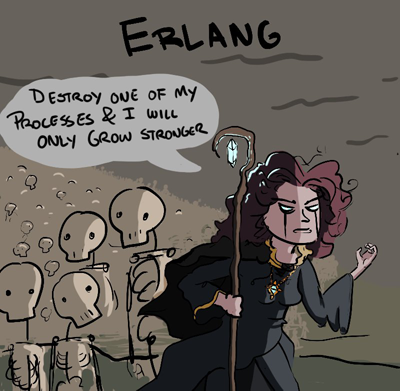
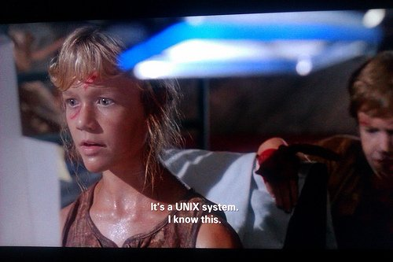
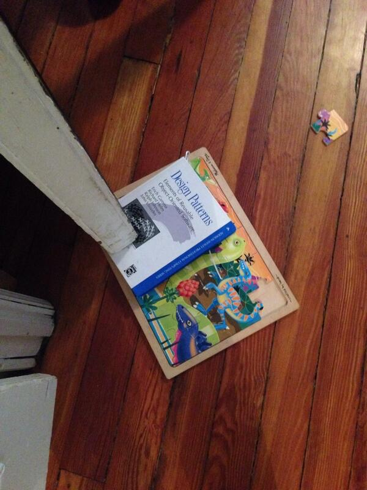
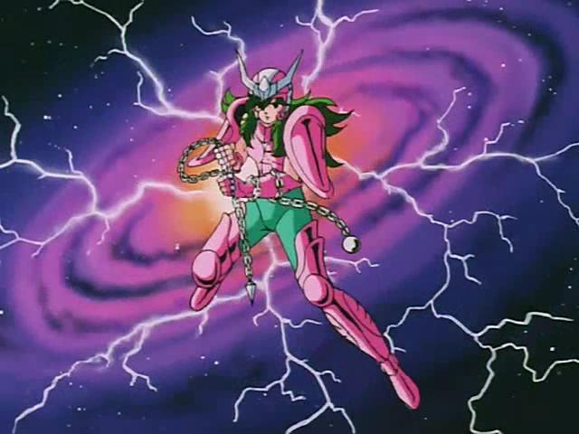
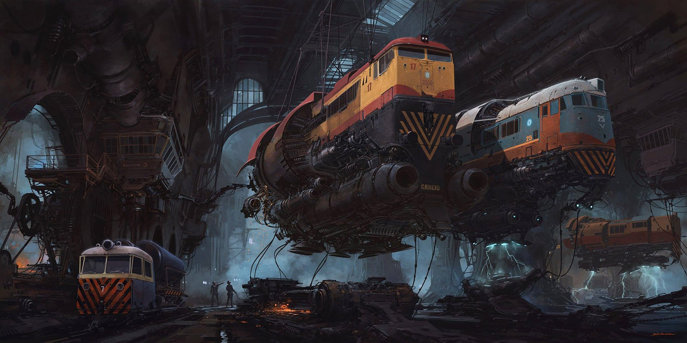

<!-- $theme: gaia -->
<!-- page_number: false -->
<!-- $size: 4:3 -->
<!-- Marp(Markdown Presentation Writer)
     https://yhatt.github.io/marp/ -->
<!-- *template: invert -->


#  Enter the Erlang 🐲🐉 with LFE

#### Todo lo que necesitas para ser un crack :tiger:

---
<!-- *template: gaia -->
# ```(lisp (flavoured (erlang)))```

LFE es un dialecto de LISP creado por
[*Roberto Virding*](https://twitter.com/rvirding) sobre la Erlang VM (beam).

Es un Lisp-2+, LFE tiene diferentes namespaces.
Podes tener una fun  `help` y una var `help`



---
<!-- *template: invert -->


---
<!-- *template: invert -->

# **<mark>¿Por qué Erlang?</mark>**
- **<mark>Es una tecnología probada con +:three::zero: años en la ~~trinchera~~ industria</mark>**
- **<mark>Manejo de concurrencia de forma sana:grey_exclamation:</mark>**
- **<mark> Soft-real time server side</mark>**
- **<mark>Capacidad de Tolerancia a fallos</mark>**
- **<mark> OTP: Patrones de diseño reales ( ̶G̶a̶n̶g̶ ̶o̶f̶ ̶F̶o̶u̶r̶)</mark>**
- **<mark> La VM es más un OS que un interprete del bytecode </mark>**


---
<!-- *template: gaia -->

###### No tenés que saber  <span style="background-color:red;">OTP</span>:heavy_exclamation_mark:
###### Si sabés un poco de Lisp, podes aprender el ecosistema sobre la marcha 🚀


---
## OTP: Patrones de diseño posta 



---
# Números
  Los enteron pueden ser tan grandes como quieras o te quedás sin memoria, lo que suceda primero :sweat_smile:

```lisp
lfe> ( + 1000000000  999999999999999999999999999999999)
1000000000000000000000000999999999
```

También hay de punto flotante, pero a nadie le importa **(?)**

```lisp
lfe> ( /  1000000444  991)
1009082.1836528758
```


---
<!-- *template: invert -->

## Cadenas
las cadenas en Erlang  son __listas__ :green_apple::tophat: ... de enteros :wink:
```lisp
lfe> (++ "Ceci n'est pas une " (99 104 97 238 110 101))
"Ceci n'est pas une chaîne"
```
```lisp
lfe> (lfe_io:format "Maximale ascii est: ~c. "
          (list (lists:max "Ceci n'est pas une chaîne")))
Maximale ascii est: î. ok
```
```clojure
erlang> io:format("Maximale ascii est: ~c. ",
          [lists:max("Ceci n'est pas une chaîne")]).
Maximale ascii est: î. ok
```
---
### Átomos
son __enums__ que se representan así mismos, los átomos empiezan con comilla simple __'__.
```lisp
lfe> (erlang:is_atom 'desinflamante)
true
```
```lisp
erlang> erlang:is_atom(desinflamante).
true
```
- __'true__ tiene un valor `truthy` y el __'false__  `falsy`
- No hay __null__:no_entry_sign:, pero podés definir el átomo
 __'null__ , __'undefined__, __'none__, __'nothing__, __'lol__ , __'ahre__

---

### Binarios -> blob


---

### Módulos


---

### Módulos

http://exercism.io/languages/lfe/about
---
<!-- *template: invert -->



---
<!-- *template: invert -->

# Dieselpunk