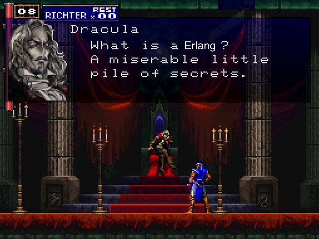

<!-- $theme: gaia -->
<!-- page_number: false -->
<!-- $size: 4:3 -->
<!-- Marp(Markdown Presentation Writer)
     https://yhatt.github.io/marp/ -->
<!-- *template: invert -->


#  Enter the Erlang :dragon_face::dragon: with LFE

#### Todo lo que necesitas para ser un crack :tiger:


---
<!-- *template: invert -->


---
<!-- *template: invert -->
# **<mark>¿Qué es Erlang?</mark>**


---
<!-- *template: invert -->

# **<mark>¿Por qué Erlang?</mark>**
- **<mark>Es una tecnología probada con +:three::zero: años en la ~~trinchera~~ industria :phone:→:computer:→:iphone:</mark>**
- **<mark>Manejo de concurrencia de forma sana:grey_exclamation:</mark>**
- **<mark> Soft-real time server side</mark>**
- **<mark>Capacidad de Tolerancia a fallos</mark>**
- **<mark> OTP: Patrones de diseño reales ( ̶G̶a̶n̶g̶ ̶o̶f̶ ̶F̶o̶u̶r̶)</mark>**
- **<mark> La VM es más un OS que un interprete del bytecode </mark>**


---
<!-- *template: gaia -->

### No tenés que saber <span style="background-color:red;"> OTP:grey_exclamation:</span>
##### Si sabés un poco de Lisp, podes aprender el ecosistema sobre la marcha <span style="background-color:white;">.:bow::books:.</span>


---
<!-- *template: gaia -->
#### Erlang es piola :100::heavy_exclamation_mark: para soft real time :alarm_clock:

·Real :alarm_clock:  -> Perder un deadline es una falla total del sistema

·Soft :ice_cream: Real :alarm_clock:  -> La utilidad de un resultado se degrada después del deadline:chart_with_downwards_trend:, pero sigue siendo útil. En sistemas de streaming se valora fluidez del servicio.

---
## OTP: Patrones de diseño posta 


---
## El Actor Model 


---
<!-- *template: gaia -->
# ```(lisp (flavoured (erlang)))```

LFE es un dialecto de LISP creado por
[*Roberto Virding*](https://twitter.com/rvirding) sobre la Erlang VM.

Es un Lisp2+, LFE tiene diferentes namespaces.
Podes tener una fun  `help` y una var `help`


---
# Números
  <html>Los enteron pueden ser tan grandes como quieras o te quedás sin memoria, lo que suceda primero :sweat_smile:</html>

```lisp
lfe> ( + 1000000000  999999999999999999999999999999999)
1000000000000000000000000999999999
```

También hay de punto flotante, pero a nadie le importa **(?)**

```lisp
lfe> ( /  1000000444  991)
1009082.1836528758
```


---
<!-- *template: invert -->

## Cadenas
las cadenas en Erlang  son __listas__ :green_apple::tophat: ... de enteros :wink:
```lisp
lfe> (++ "Ceci n'est pas une " (99 104 97 238 110 101))
"Ceci n'est pas une chaîne"
```
```lisp
lfe> (lfe_io:format "Maximale ascii est: ~c. "
          (list (lists:max "Ceci n'est pas une chaîne")))
Maximale ascii est: î. ok
```
```clojure
erlang> io:format("Maximale ascii est: ~c. ",
          [lists:max("Ceci n'est pas une chaîne")]).
Maximale ascii est: î. ok
```
---
### Átomos
son __enums__ que se representan así mismos, los átomos empiezan con comilla simple __'__.
```lisp
lfe> (erlang:is_atom 'desinflamante)
true
```
```lisp
erlang> erlang:is_atom(desinflamante).
true
```
- __'true__ tiene un valor `truthy` y el __'false__  `falsy`
- No hay __null__:no_entry_sign:, pero podés definir el átomo
 __'null__ , __'undefined__, __'none__, __'nothing__, __'lol__ , __'ahre__

---

### Binarios -> blob


---
## Erlang viene con :two: 🛢️ DBs build-in
### ETS y Mnesia


---

### Módulos


---

### Módulos

En Erlang los modulos contienen las funciones y estas tienen
---
<!-- *template: invert -->


---
<!-- *template: invert -->

# Dieselpunk