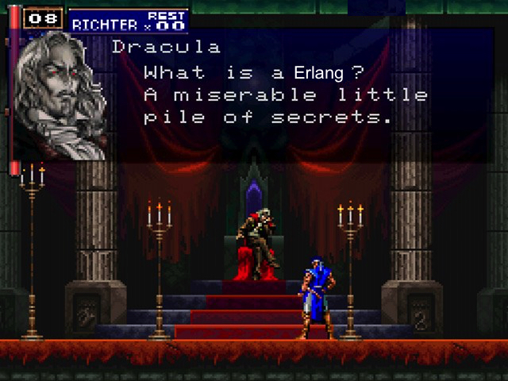
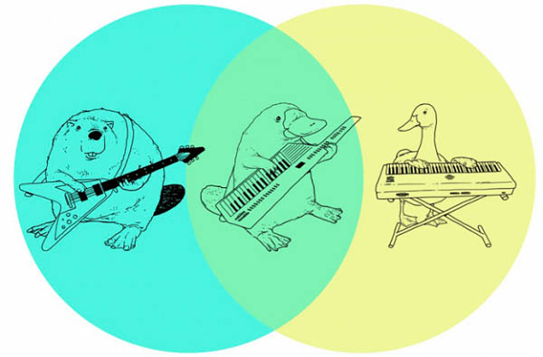
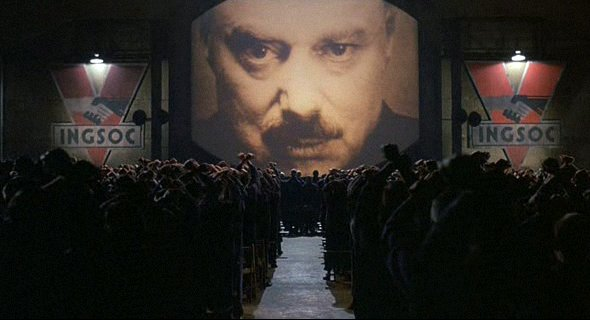

<!-- $theme: gaia -->
<!-- page_number: false -->
<!-- $size: 4:3 -->
<!-- *template: invert -->


#  Enter the Erlang :dragon_face::dragon: with LFE


### by David Cao

---
<!-- *template: gaia -->
# **<span style="background-color:red;">What is Erlang?</span>**



---
<!-- *template: invert -->

# **<mark>Why Erlang?</mark>**
- **<mark>It is a technology tested for :three::zero:+ years on the industry :phone:→:computer:→:iphone:</mark>**
- **<mark>It manage concurrency in a healthy way:grey_exclamation:</mark>**
- **<mark> Soft-real time server side</mark>**
- **<mark>Fault Tolerance</mark>**
- **<mark> OTP: real design patterns (̶G̶a̶n̶g̶ ̶o̶f̶ ̶F̶o̶u̶r̶)</mark>**
- **<mark> The VM is more an OS rather than an bytecode's interpreter del  </mark>**


---
<!-- *template: gaia -->

### You don't have to know <span style="background-color:red;"> OTP:grey_exclamation:</span>
##### If you already know a little of lisp, you can learn the ecosystem on the go <span style="background-color:white;">.:bow::books:.</span>


---
<!-- *template: gaia -->
#### Erlang is good :100::heavy_exclamation_mark: for soft real time :alarm_clock:

Real :alarm_clock:  -> missing a deadline is a total system failure.

Soft :ice_cream: Real :alarm_clock:  ->the usefulness of a result degrades after its deadline:chart_with_downwards_trend:, but it still usefull et al:heavy_exclamation_mark:.
In streaming is valued the continuity of service.

The most of te services nowadays are soft-real time 24/7


---

## OTP: Real Life Design Patterns 


---

<!-- *template: gaia -->

# The Actor Model
In Erlang, actors are isolated lightweith process running on the Beam (they aren't OS threads)
* They comunicate by msg passing :envelope: (mutability)
* They have their own  __mail box__ :mailbox_with_mail:
* No :lock: lock/mutex to manage concurrency :ok_hand::100: :heavy_exclamation_mark:
* Every actor has their own heap y garbage collector
* Cualquier parecido con la POO es pura coinidencia(?)

---
<!-- *template: gaia -->
## Behaviour
It's A pattern desing :smile:, es parecido a la herencia en POO o una Java's interface.

An amount of callbacks (contract) must be defined for the __behaviour__ works.



---

<!-- *template: gaia -->
## Supervisor
supervisor is an __behaviour__ responsable de arrancar, parar y monitorear sus procesos hijos.

Siempre es un nodo del arbol de procesos, en cambio los procesos worker son hoja o terminales.


---

<!-- *template: gaia -->
## Gen Server (aka Microservices)
It is a pattern for code generic server in Erlang.
La idea es separa la funcionalidad del manejo de la concurrencia del servidor a travez de callbacks.

__handle_call__: synchronou calls ( wait for an answer)
__handle_cast__: asynchronou calls (no wait for an answer)

the code inside the handler will be served by a Beam's process.

---
<!-- *template: gaia -->
# ```(lisp (flavoured (erlang)))```

LFE es LISP's dialect created by
[*Roberto Virding*](https://twitter.com/rvirding) sobre la Erlang VM.

Es un Lisp2+, LFE tiene diferentes namespaces.
Podes tener una fun  `help` y una var `help`


---
# Numbers
  Integers could so big that you want or you get out of memory, whichever occurs first.  :sweat_smile:

```lisp
lfe> ( + 1000000000  999999999999999999999999999999999)
1000000000000000000000000999999999
```

There is not **'nan** or **'infinity**, you have to create it.

```lisp
lfe> ( /  1000000444  991)
1009082.1836528758
lfe> (/ 1.0  0.0)
exception error: error in arithmetic expression
  in (erlang : / 1.0 0.0)
```


---
<!-- *template: invert -->

## Cadenas
Strings on Erlang are __lists__ :green_apple::tophat: ... but of integers :wink:
```lisp
lfe> (++ "Ceci n'est pas une " (99 104 97 238 110 101))
"Ceci n'est pas une chaîne"
```
```lisp
lfe> (lfe_io:format "Maximale ascii est: ~c. "
          (list (lists:max "Ceci n'est pas une chaîne")))
Maximale ascii est: î. ok
```
```clojure
erlang> io:format("Maximale ascii est: ~c. ",
          [lists:max("Ceci n'est pas une chaîne")]).
Maximale ascii est: î. ok
```
---
### Atoms
They are  __enums__ que se representan itself, also atoms starts with con comilla simple __'__.
```lisp
lfe> (erlang:is_atom 'atom)
true
```
```lisp
erlang> erlang:is_atom(atom).
true
```
- __'true__ has a `truthy` valuey and __'false__  `falsy`
- No hay __null__:no_entry_sign:, pero podĂŠs definir el ĂĄtomo
 __'null__ , __'undefined__, __'none__, __'nothing__, __'lol__ , __'ahre__

---

### Tuplas

```lisp
lfe> (tuple 'ok "I am a pickle!")
#(ok "I am a pickle!")
lfe> (tuple 1 2 3 4 5)
#(1 2 3 4 5)
lfe> #(1 9)
#(1 9)
```
###### Maps :earth_americas:

```lisp
lfe> (map 'key 'value)
#M(key value)
lfe> (map 'lfe  "Erlang" 'creator "Robert Virding")
#M(lfe "Erlang" creator "Robert Virding")
```
---

#### Modules, Functions and Pattern Matching
```lisp
lfe> (set (tuple 'error msg) (tuple 'error "Error :("))
#(error "Error :(")
lfe> msg
"Error :("
```
Every module name is an **atom()!**
Also el Pattern Matching es conceptualmente similar to OOP's dispacher.
```lisp
 (defmodule conversion
  (export (convert-length 1)))

(defun convert-length
  (((tuple 'centimeter x)) (tuple 'inch (/ x 2.54)))
  (((tuple 'inch y)) (tuple 'centimeter (* y 2.54))))
```

---
<!-- *template: invert -->
#### Modules, applicacions and libraries

En Erlang tener un **main(args ...)** no tiene mucho sentido (como punto de entrada), es mas para nostalgicos de otros lenguajes.

Dado que que podes tener varios procesos escuchando.


---
### Exersism's Example

```lisp
(defmodule leap
  (export all))

(defun leap-year
  ((year)  (when (== 0 (rem year 400)))
    'true)
  ((year)  (when (== 0 (rem year 100)))
    'false)
  ((year)  (when (== 0 (rem year 4)))
    'true)
  ((_year)
    'false))
```
---
### Exersism's Example

```lisp
(defmodule rna-transcription
  (export (to-rna 1)))

(defun to-rna-char
    ([#\G] #\C)
    ([#\C] #\G)
    ([#\T] #\A)
    ([#\A] #\U))

(defun to-rna (dnaList)
    (lists:map #'to-rna-char/1 dnaList))
```
---
<!-- *template: gaia -->
## Erlang came with 3 DBs build-in

__ETS__ (Erlang Term Storage) is a inmemory BD that vcan save any kind of erlang term()

__DETS__ (Disk ETS) es similar a la ETS pero con persistencia en disco con un lĂ­mite de 2G.

__Mnesia__ es una capa comstruida sobre la ETS y la DETS que permite transaciones.

The most used are ETS y Mnesia


---
<!-- *template: invert -->


---
<!-- *template: invert -->

# Dieselpunk

---
<!-- template: invert -->

